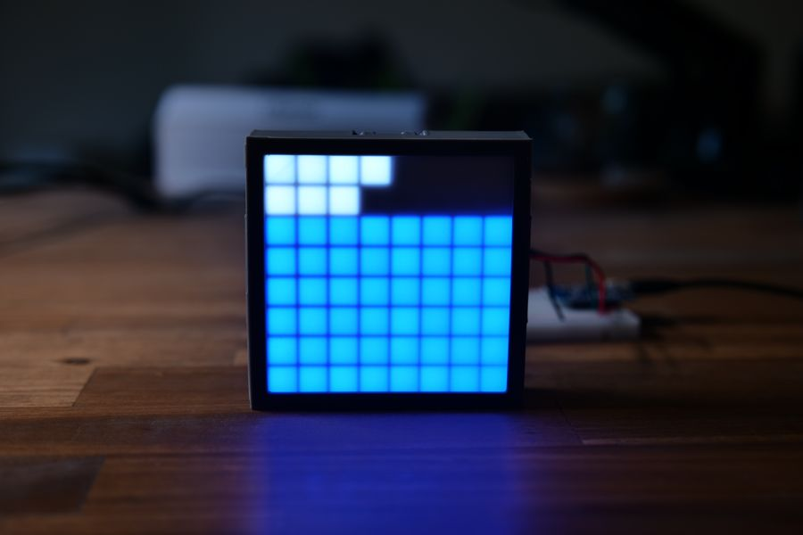

# esp-cs2-gsi-matrix



ESP server to show CS2 game state on an RGB matrix.

3D printed case by @adafruit is available [on Printables](https://www.printables.com/model/38777-neomatrix-square-led-pixel-display).

## Setup

Any ESP board with WiFi and a WS2812 LED matrix like Adafruit NeoMatrix should work.

This specific config was tested with:

- Wemos D1 Mini
- 8x8 Adafruit NeoMatrix
- PlatformIO CLI

Define hardware settings in `main.h`, set the dimension of your matrix.

```
pio run -t upload
```

Add the following config to your CS2 cfg folder, setting your ESP IP on the `uri` key:

```

"ESPCS2GSI Integration v1.0.0"
{
 "uri" "http://10.0.3.25"
 "timeout" "5.0"
 "buffer" "0.1"
 "throttle" "0.5"
 "heartbeat" "15.0"
 "data"
 {
   "round"          "1" // round phase, bomb state and round winner
   "player_state"   "1" // player state (used for health)
 }
}
```
